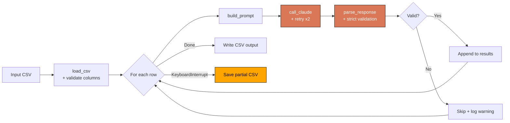

# CSV Product Enricher

[](https://www.python.org/downloads/)
[](LICENSE)
[](https://github.com/astral-sh/ruff)
[](https://www.anthropic.com)

A Python CLI that takes raw product CSVs and adds SEO tags, category paths, improved copy, and readability scores — via the Anthropic Claude API.

## Why this exists

Writing SEO-ready copy and categorizing products at scale is repetitive and error-prone when done manually. This script automates that pipeline: feed it a CSV with SKUs, titles, and descriptions; it returns a new CSV with four enrichment columns ready to paste into any e-commerce backend or PIM system.

## What it does

- Reads a CSV with `sku`, `title`, `description` columns
- Calls the Claude API for each row and parses the structured JSON response
- Adds `seo_tags`, `category`, `enhanced_description`, and `readability_score` columns
- Retries failed API calls with exponential backoff (max 2 attempts per row)
- Saves a partial output file automatically if the run is interrupted mid-way

## Quick start

```bash
git clone https://github.com/alexisgarcia-dev/csv-product-enricher
cd csv-product-enricher
pip install -r requirements.txt
cp .env.example .env   # then add your ANTHROPIC_API_KEY
python enricher.py --input samples/input_sample.csv --output output_enriched.csv
```

## Architecture

The script is split into two modules: `enricher.py` handles orchestration, retry logic, and the CLI; `prompts.py` owns the prompt template and row formatting. Console output (progress bar, per-row status, final summary) is handled entirely by `rich`.



Data flows through a pandas DataFrame with enrichment results written back as new columns at the end of each run, avoiding partial writes on failure. If interrupted mid-run, partial results are saved with a `.partial.csv` suffix.

## Sample input / output

**Input** (`samples/input_sample.csv`)

| sku | title | description |
|-----|-------|-------------|
| ELEC-001 | Wireless Noise-Cancelling Headphones | Over-ear headphones with active noise cancellation, 30h battery, and foldable design. |
| BEAU-004 | Vitamin C Brightening Serum | 30ml face serum with 15% vitamin C, hyaluronic acid, and niacinamide. All skin types. |

**Output** (`samples/output_sample.csv`)

| sku | seo_tags | category | enhanced_description | readability_score |
|-----|----------|----------|----------------------|-------------------|
| ELEC-001 | wireless headphones, noise cancelling headphones, over ear headphones, bluetooth headphones, premium audio headset | Electronics > Audio > Headphones | Premium over-ear headphones with adaptive noise cancellation and 30-hour battery life. Foldable design suits daily commutes and travel. | 8.5 |
| BEAU-004 | vitamin c serum, brightening face serum, anti-aging serum, hyaluronic acid serum, dark spot corrector | Beauty > Skincare > Serums | Brightening face serum with 15% vitamin C, hyaluronic acid, and niacinamide. Suitable for all skin types, fragrance-free formulation. | 8.7 |

## Configuration

**Environment variables** (`.env`):

| Variable | Required | Description |
|----------|----------|-------------|
| `ANTHROPIC_API_KEY` | Yes | Your Anthropic API key |

**CLI flags**:

| Flag | Default | Description |
|------|---------|-------------|
| `--input` | (required) | Path to input CSV |
| `--output` | (required) | Path to output CSV |
| `--model` | `claude-haiku-4-5-20251001` | Anthropic model ID |
| `--verbose` / `-v` | off | Print full prompts and API responses |

## Limitations & roadmap

**Current limitations**

- Sequential processing: 500-row CSV takes ~5-8 minutes at Haiku speed (see [#1](../../issues/4) for async batching)
- Output quality depends on input description richness
- No deduplication: same SKU enriched twice if duplicated in input

**Planned improvements** (tracked in [issues](../../issues))

- [ ] Async batch processing ([#1](../../issues/4))
- [ ] Pytest coverage ([#2](../../issues/5))
- [ ] GitHub Actions CI ([#3](../../issues/6))
- [ ] Configurable output field selection

## Repository structure

```
csv-product-enricher/
|-- enricher.py          # CLI + orchestration + retry logic
|-- prompts.py           # Prompt template + row formatting
|-- requirements.txt     # Python dependencies
|-- .env.example         # Environment variables template
|-- samples/             # Sample input/output CSVs
|   |-- input_sample.csv
|   `-- output_sample.csv
|-- tests/               # Test suite (pytest)
|   |-- __init__.py
|   `-- test_enricher.py
`-- README.md
```

## License

MIT — see [LICENSE](LICENSE)

## Built by

**Alexis Garcia** — Python Developer | AI Automation & Pipelines  
Available for freelance work: [Upwork profile](https://www.upwork.com/freelancers/~01cbfcf39110510e66)
